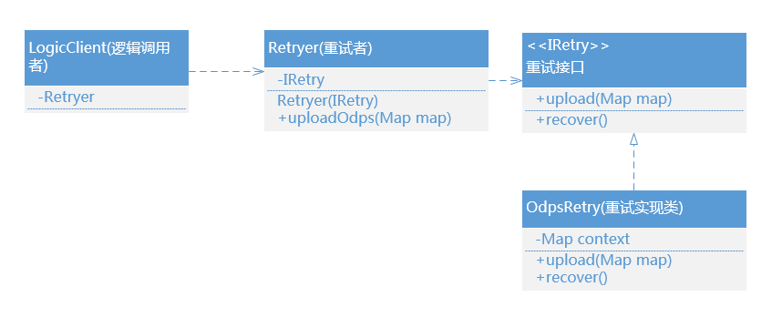

# 缺陷

方案一和方案二存在一个问题：

正常逻辑和重试逻辑强耦合，重试逻辑非常依赖正常逻辑的执行结果，对正常逻辑预期结果被动重试触发，对于重试根源往往由于逻辑复杂被淹没，
可能导致后续运维对于重试逻辑要解决什么问题产生不一致理解。

重试正确性难保证而且不利于运维，原因是重试设计依赖正常逻辑异常或重试根源的臆测

# 优雅重试方案尝试

那有没有可以参考的方案实现正常逻辑和重试逻辑解耦，同时能够让重试逻辑有一个标准化的解决思路？
    
答案是有：那就是基于代理设计模式的重试工具，我们尝试使用相应工具来重构上述场景。

## 尝试方案一：应用命令设计模式解耦正常和重试逻辑

命令设计模式具体定义不展开阐述，主要该方案看中命令模式能够通过执行对象完成接口操作逻辑，同时内部封装处理重试逻辑，不暴露实现细节，
对于调用者来看就是执行了正常逻辑，达到解耦的目标，具体看下功能实现。（类图结构）

IRetry约定了上传和重试接口，其实现类OdpsRetry封装ODPS上传逻辑，同时封装重试机制和重试策略。与此同时使用recover方法在结束执行做恢复操作。   

而我们的调用者LogicClient无需关注重试，通过重试者Retryer实现约定接口功能，同时 Retryer需要对重试逻辑做出响应和处理， 
Retryer具体重试处理又交给真正的IRtry接口的实现类OdpsRetry完成。

通过采用命令模式，优雅实现正常逻辑和重试逻辑分离，同时通过构建重试者角色，实现正常逻辑和重试逻辑的分离，让重试有更好的扩展性。

## 方案二

Spring-retry工具虽能优雅实现重试，但是存在两个不友好设计：

一个是重试实体限定为Throwable子类，说明重试针对的是可捕捉的功能异常为设计前提的，但是我们希望依赖某个数据对象实体作为重试实体，
但Sping-retry框架必须强制转换为Throwable子类。

另一个就是重试根源的断言对象使用的是 doWithRetry的Exception 异常实例，不符合正常内部断言的返回设计。

Spring Retry提倡以注解的方式对方法进行重试，重试逻辑是同步执行的，重试的“失败”针对的是Throwable，
如果你要以返回值的某个状态来判定是否需要重试，可能只能通过自己判断返回值然后显式抛出异常了。

# 优雅重试共性和原理

正常和重试优雅解耦，重试断言条件实例或逻辑异常实例是两者沟通的媒介。

约定重试间隔，差异性重试策略，设置重试超时时间，进一步保证重试有效性以及重试流程稳定性。

都使用了命令设计模式，通过委托重试对象完成相应的逻辑操作，同时内部封装实现重试逻辑。

Spring-tryer和guava-tryer工具都是线程安全的重试，能够支持并发业务场景的重试逻辑正确性。

# 优雅重试适用场景

功能逻辑中存在不稳定依赖场景，需要使用重试获取预期结果或者尝试重新执行逻辑不立即结束。比如远程接口访问，数据加载访问，数据上传校验等等。

对于异常场景存在需要重试场景，同时希望把正常逻辑和重试逻辑解耦。

对于需要基于数据媒介交互，希望通过重试轮询检测执行逻辑场景也可以考虑重试方案。

# 参考资料

[Retry重试机制](https://blog.csdn.net/paul_wei2008/article/details/53871442)

